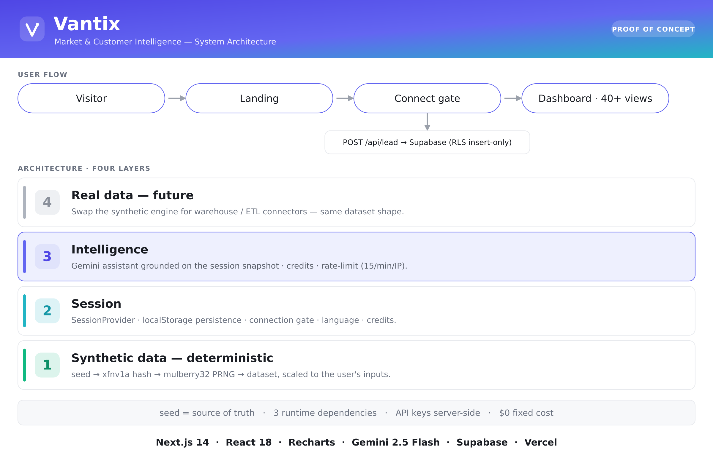

# Vantix — Market & Customer Intelligence

> Predictive intelligence that turns **churn** and **customer lifetime value (CLV)** into decisions that protect and grow revenue.

**Live demo:** https://vantix-inky.vercel.app · **Proof of concept** — all figures are synthetic; no real data is processed.

Vantix shows what a modern churn & customer-intelligence platform can *feel* like: you arrive with an empty dashboard, "connect" your business (name + a few parameters), and instantly get a dashboard **scaled to your numbers** — backed by a **real AI assistant** grounded on your session data. Built in public as one experiment in a "SaaS Factory".



---

## ✨ Highlights

- **Personalized in one click** — no signup. Enter a company + business size and the whole dashboard is generated, deterministically, from a seed derived from your inputs.
- **Real AI assistant** — Google Gemini behind a server-side proxy, grounded on a snapshot of your session data, with credits and rate-limiting.
- **40+ analytics views** — churn root cause, CLV attribution & bridge, live cohorts, RFM value×risk matrix, forecasting + seasonality, Monte Carlo, network analysis, micro-studies, what-if simulator, Next Best Action, financial modeling, governance/RBAC, and more.
- **Bilingual (EN/ES)** — English-primary with a live language toggle; every string is co-located in both languages.
- **Fully responsive** — landing, connect gate and the entire dashboard adapt from desktop to tablet to phone (Stripe-style).
- **Zero-cost by design** — synthetic data, free tiers, and only **three** runtime dependencies.

---

## 🧱 Tech stack

| Layer | Choice |
|-------|--------|
| Framework | **Next.js 14.2** (App Router) |
| UI | **React 18** + JSX, **inline styles** (no CSS framework) |
| Charts | **Recharts 2.12** + hand-authored SVG visualizations |
| AI | **Google Gemini** (`gemini-2.5-flash`) via a provider-agnostic proxy |
| Lead store | **Supabase** (Postgres) via REST, RLS insert-only |
| Hosting / CI | **Vercel** — every push to `main` auto-deploys to production |
| Languages | **JavaScript (ES2020+)**, **JSX**, **CSS**, **SQL**, **Markdown** |

> Only **3 runtime dependencies**: `next`, `react`, `recharts`. No LLM SDK, no Supabase SDK, no UI kit — the AI and database calls are plain `fetch` to keep the surface (and cost) minimal and the API keys server-side.

---

## 📚 Documentation

- **[Executive Summary](docs/EXECUTIVE_SUMMARY.md)** — the what & why, in one page.
- **[Architecture (master doc)](docs/ARCHITECTURE.md)** — the full system: layers, subsystems, data flow, security, cost, decisions.

---

## 🚀 Quickstart

```bash
npm install
cp .env.example .env.local      # then paste your keys
npm run dev                     # http://localhost:3000
```

Without an API key the assistant runs in **demo mode** (pre-generated answers, zero cost): set `LLM_PROVIDER=demo`.

---

## 🔑 Environment variables

| Variable | What it is | Example |
|----------|------------|---------|
| `LLM_PROVIDER` | Active LLM provider | `gemini` or `demo` |
| `GEMINI_API_KEY` | Google AI Studio key | `AIza…` |
| `GEMINI_MODEL` | Model id | `gemini-2.5-flash` |
| `SUPABASE_URL` | Project URL (optional; lead capture) | `https://<ref>.supabase.co` |
| `SUPABASE_ANON_KEY` | Anon/public key (optional) | `eyJ…` |

Keys live only in `.env.local` (local) or Vercel env vars (production) — **never** in the repo. If Supabase vars are absent, the demo still works; it just doesn't store leads.

---

## 🗂️ Project structure

```
vantix/
├── app/
│   ├── api/assistant/route.js   # LLM proxy (server-side key + rate-limit)
│   ├── api/lead/route.js        # lead capture → Supabase REST
│   ├── globals.css              # base + responsive rules
│   ├── icon.svg                 # favicon
│   ├── layout.js                # root layout + fonts + metadata
│   └── page.js                  # mounts the app
├── components/
│   ├── VantixApp.jsx            # the entire UI (landing + gate + dashboard)
│   └── session.jsx              # SessionProvider, persistence, useIsMobile
├── lib/
│   ├── synth.js                 # seeded synthetic-data engine
│   └── llm.js                   # provider-agnostic LLM client
├── docs/                        # executive summary + architecture
└── .env.example                 # env template (no secrets)
```

---

## 🧪 Status

**Proof of concept**, for demonstration only. All figures are synthetic and generated from your inputs — no real customer data is processed. Brand names shown on the landing illustrate the AI models and integrations and do not imply any partnership or endorsement.

Built in public — feedback and ideas welcome.
